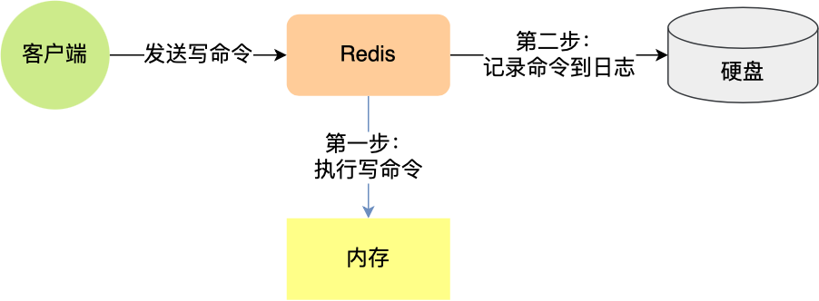
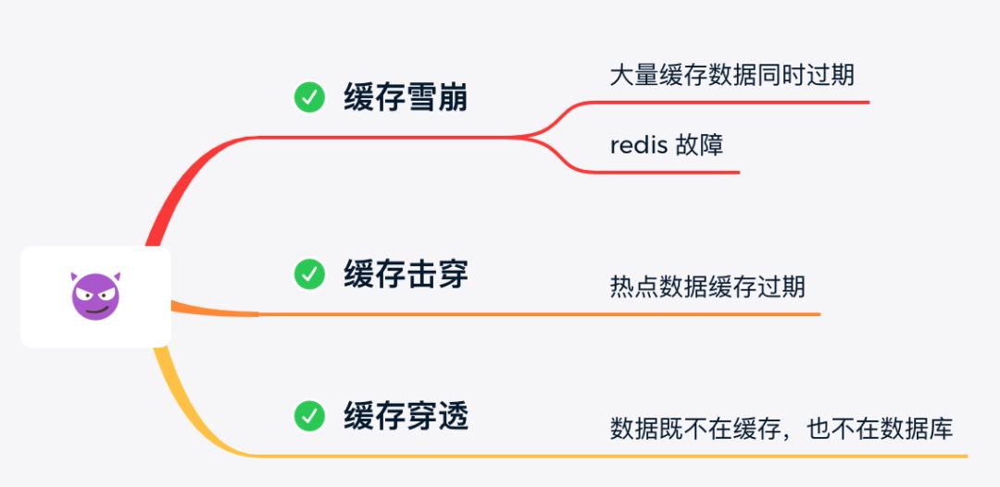
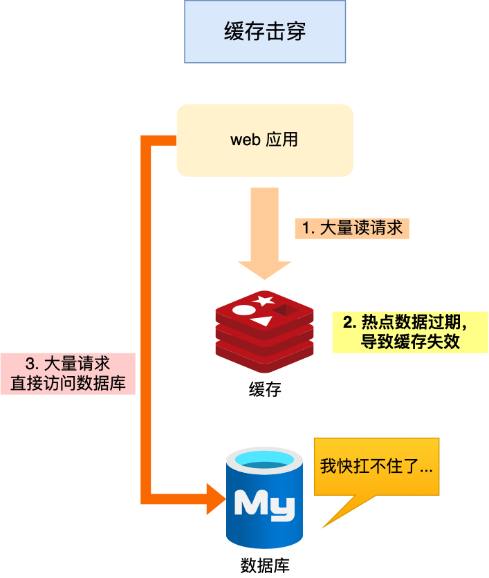

[TOC]

# 数据结构


Redis 键值对结构：


Redis object 结构：


- type，标识该对象是什么类型的对象（String 对象、 List 对象、Hash 对象、Set 对象和 Zset 对象）；
- encoding，标识该对象使用了哪种底层的数据结构；
- **ptr，指向底层数据结构的指针**。

## 1.SDS（simple dynamic string）

C 字符串缺陷：


- 获取字符串长度的时间复杂度为 O（N）；
- 字符串的结尾是以 “\0” 字符标识，字符串里面不能包含有 “\0” 字符，因此不能保存二进制数据；
- 字符串操作函数不高效且不安全，比如有缓冲区溢出的风险，有可能会造成程序运行终止；


核心：存储 meta，空间换时间，meta 占空间小，换时间大，值得；

## 2. 链表


```c
typedef struct list {
    //链表头节点
    listNode *head;
    //链表尾节点
    listNode *tail;
    //节点值复制函数
    void *(*dup)(void *ptr);
    //节点值释放函数
    void (*free)(void *ptr);
    //节点值比较函数
    int (*match)(void *ptr, void *key);
    //链表节点数量
    unsigned long len;
} list;
```

核心：meta 小空间换时间、双向链表

## 3. 哈希表


Key word:**渐进式 hash**

```c
typedef struct dict {
    …
    //两个Hash表，交替使用，用于rehash操作
    dictht ht[2]; 
    …
} dict;

typedef struct dictht {
    //哈希表数组
    dictEntry **table;
    //哈希表大小
    unsigned long size;  
    //哈希表大小掩码，用于计算索引值
    unsigned long sizemask;
    //该哈希表已有的节点数量
    unsigned long used;
} dictht;

typedef struct dictEntry {
    //键值对中的键
    void *key;
  
    //键值对中的值
    union {
        void *val;
        uint64_t u64;
        int64_t s64;
        double d;
    } v;
    //指向下一个哈希表节点，形成链表
    struct dictEntry *next;
} dictEntry;
```


## 4. 压缩列表


CON：

* **prevlen**  连锁更新-- listpack（Redis 5.0 更新解决）

## 5. 整数集合

```c
typedef struct intset {
    //编码方式
    uint32_t encoding;
    //集合包含的元素数量
    uint32_t length;
    //保存元素的数组
    int8_t contents[];
} intset;
```

## 6. 跳表


## 7. listpack--解决 ziplist 连锁更新


# 持久化

|      | AD             | CON        |
| ---- | -------------- | ---------- |
| AOF  | 可靠性高       | 文件大     |
| RDB  | 文件小，恢复快 | 全量备份慢 |


## 1. AOF



先执行，后写日志：

* 避免额外的检查开销，防止有语法问题命令写入日志
* 不阻塞当前写操作命令的执行

| 写盘策略  | 写盘时机   | AD       | CON            |
| --------- | ---------- | -------- | -------------- |
| Always    | 同步写磁盘 | 可靠性高 | 性能开销大     |
| Every sec | 每秒刷盘   | 性能适中 | 宕机丢 1s 数据 |
| No        | OS 控制    | 性能好   | 宕机丢数据多   |

## 2. RDB

二进制数据

# 缓存失效




## 1. 缓存穿透


解决：布隆过滤器


## 2. 缓存雪崩


## 3. 缓存击穿



